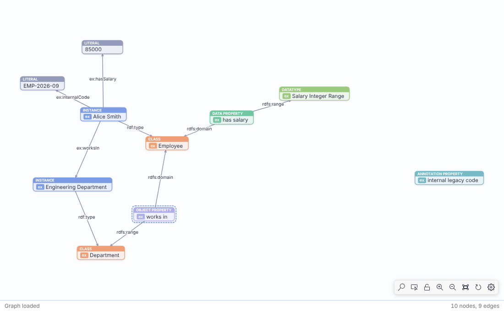
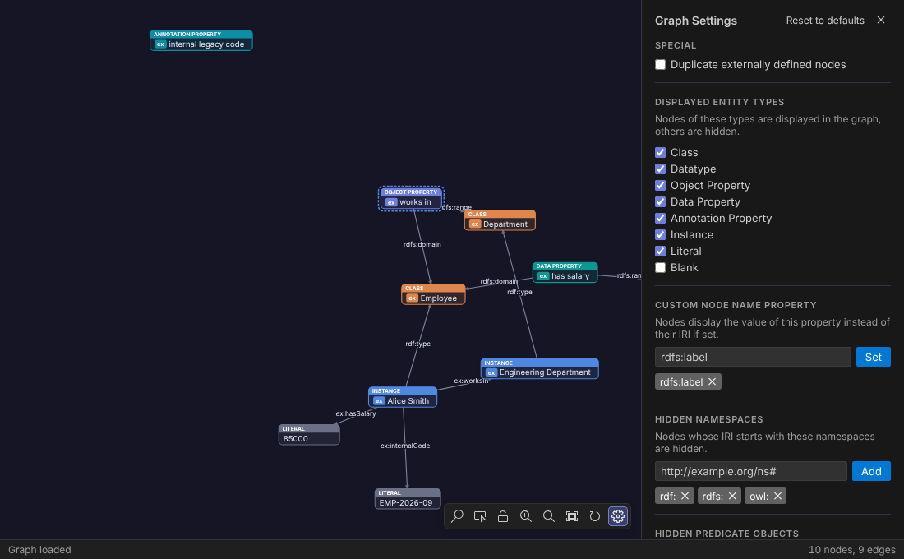

<h1 align="center">
  <br>
  Carapace Turtle for VS Code
</h1>

<h4 align="center">Live, OWL-aware graph visualisation for Turtle (TTL) ontologies — right next to your editor.</h4>

This extension brings [**Carapace**](https://github.com/sellsol/carapace), the text-first Turtle ontology editor and graph visualiser, into VS Code. It is an independent, unofficial port and is not affiliated with the Carapace project. Write Turtle in VS Code's editor and watch the graph update beside it. Carapace's graph engine is ported unchanged, so classes, properties, instances, literals, blank nodes and OWL collections are drawn exactly as on [carapace.space](http://www.carapace.space).

<p align="center">
  
</p>
<p align="center">
  
</p>

## Features

- **Live graph preview.** Open any `.ttl` file and run **Carapace: Open Graph to the Side** (`Ctrl+K G` / `Cmd+K G`, or the graph icon in the editor title bar). The graph updates as you type. While the document has a syntax error the last valid graph stays visible and the error is shown in the status line.
- **OWL-aware rendering.** Nodes are classified as class, datatype, object/data/annotation property, instance, literal or blank node, using `rdf:type` and what can be inferred from `rdfs:subClassOf`, `rdfs:domain`, `rdfs:range` and similar predicates. `owl:unionOf`, `owl:intersectionOf`, `owl:oneOf` and RDF lists are drawn as collection nodes. By default nodes show their `rdfs:label`.
- **Editor ↔ graph navigation.**
    - Click a node to jump to the line that defines it. Double-click a node to jump there and focus the editor.
    - The graph selects the node defined on the line under your cursor. Set `carapace.preview.followCursor` to `center` to also pan to it, or to `off` to disable this.
    - **Carapace: Reveal Node at Cursor in Graph** (`Ctrl+Alt+G` / `Cmd+Alt+G`) centres the node for the current line.
- **Graph controls.**
    - Scroll to pan, Ctrl/Cmd + scroll (or pinch) to zoom.
    - Drag nodes to arrange them. Ctrl/Cmd+click or use box-select mode to move several nodes at once.
    - Lock the layout to protect a hand-made arrangement, and re-run the force layout at any time.
    - Ctrl/Cmd+F searches nodes and predicates.
- **Fine-grained visualiser settings** (gear icon). For each document you can:
    - choose which entity types are shown,
    - hide namespaces, objects of given predicates, or instances of given classes,
    - pick the predicate used for node names,
    - draw externally defined nodes once per reference.

    Defaults for new documents come from the `carapace.graph.*` settings.

- **Remembers your work.** Layout, camera, lock state and settings are saved per document in the workspace.
- **Export** the graph as **SVG** or **PNG**, cropped to the graph. Exports use the light palette by default; set `carapace.export.theme` to `current` to keep the current theme.
- **Turtle 1.1 and 1.2.** The parser checks documents strictly against the [W3C Turtle grammar](https://www.w3.org/TR/rdf12-turtle/) and passes the official W3C test suites: all 313 Turtle 1.1 tests and all 419 Turtle 1.2 tests. Turtle 1.2 additions are supported in parsing, highlighting and the graph:
    - `VERSION "1.2"` / `@version` directives
    - triple terms `<<( s p o )>>`
    - reified triples `<< s p o ~ :r >>`
    - annotations `{| … |}`
    - base direction on language tags (`"text"@ar--rtl`)

    Triple terms appear as **Triple Term** cards with a subject, predicate and object row. The subject and object rows connect to their nodes. Identical triple terms share one node, and they can be hidden like any other entity type. Annotations (`{| … |}`) are drawn on the triple term they describe. Named reifiers are shown as instances. Clicking a reifier jumps to the reified statement. N3-only syntax (formulas, `=>`, variables) is reported as an error.

- **Turtle language support.**
    - Syntax highlighting, including the Turtle 1.2 syntax.
    - Syntax errors in the Problems panel.
    - An outline of all defined entities, with their types.
    - **Go to Definition** and hover information for prefixed names and IRIs.
- **RDF/XML import.** **Carapace: Convert RDF/XML to Turtle** (also in the Explorer context menu for `.rdf`/`.owl`/`.xml`) opens the converted Turtle in a new editor.
- **Carapace: New Sample Ontology** opens a small example ontology with its graph, to try things out.

## Commands

| Command                                       | Description                                                 |
| --------------------------------------------- | ----------------------------------------------------------- |
| `Carapace: Open Graph to the Side`            | Open the graph for the active Turtle file beside the editor |
| `Carapace: Open Graph`                        | Open the graph in the current editor group                  |
| `Carapace: Reveal Node at Cursor in Graph`    | Select and centre the node defined on the cursor line       |
| `Carapace: Search Graph`                      | Search nodes and predicates                                 |
| `Carapace: Fit Graph to View`                 | Zoom to fit the whole graph                                 |
| `Carapace: Re-run Graph Layout`               | Recompute the force-directed layout                         |
| `Carapace: Toggle Graph Lock`                 | Lock/unlock the layout                                      |
| `Carapace: Graph Settings`                    | Show the per-document graph settings                        |
| `Carapace: Export Graph as SVG / PNG`         | Export the graph image                                      |
| `Carapace: Reset Graph Settings for Document` | Restore the default graph settings                          |
| `Carapace: Forget Saved Layout for Document`  | Discard the saved layout and lay the graph out again        |
| `Carapace: Convert RDF/XML to Turtle`         | Convert an `.rdf`/`.owl`/`.xml` file to Turtle              |
| `Carapace: New Sample Ontology`               | Open the sample ontology with its graph                     |

## Settings

| Setting                                  | Default                 | Description                                                        |
| ---------------------------------------- | ----------------------- | ------------------------------------------------------------------ |
| `carapace.preview.updateDelay`           | `300`                   | Delay (ms) before edits are reflected in the graph                 |
| `carapace.preview.followCursor`          | `highlight`             | `off`, `highlight` or `center` the node at the editor cursor       |
| `carapace.preview.revealLineOnNodeClick` | `true`                  | Clicking a node moves the editor to its definition                 |
| `carapace.diagnostics.enabled`           | `true`                  | Report Turtle syntax errors in the Problems panel                  |
| `carapace.export.theme`                  | `light`                 | Palette used for SVG/PNG exports (`light` or `current`)            |
| `carapace.graph.hiddenEntityTypes`       | `["blank"]`             | Entity types hidden in new documents                               |
| `carapace.graph.hiddenNamespaces`        | `rdf:`, `rdfs:`, `owl:` | Namespaces whose nodes are hidden in new documents                 |
| `carapace.graph.hiddenPredicates`        | `[]`                    | Predicates whose objects are hidden in new documents               |
| `carapace.graph.hiddenInstanceOf`        | `owl:Ontology`          | Nodes typed with these classes are hidden in new documents         |
| `carapace.graph.nodeNamePredicate`       | `rdfs:label`            | Predicate whose value is used as the node name (empty: local name) |
| `carapace.graph.duplicateExternalNodes`  | `false`                 | Draw external nodes once per reference                             |

IRIs in the `carapace.graph.*` settings can be written in full or with the `rdf:`, `rdfs:`, `owl:` and `xsd:` prefixes.

## Architecture

```
src/
├── core/        Carapace's graph engine, ported from the web app without framework dependencies:
│                Turtle parsing and node↔line mapping (N3.js), preprocessing, graph building, node measuring,
│                plus the outline and term helpers used by the language features
├── extension/   Extension host: graph panels (webviews), language features (diagnostics, outline,
│                definition, hover), RDF/XML conversion, per-document state, commands
├── webview/     Graph UI in plain TypeScript + SVG: renderer (port of GraphNode/GraphEdge), d3-force layout,
│                pan/zoom/drag/box-select, search, settings panel, SVG/PNG export
└── shared/      Typed message protocol between the extension host and the webview
```

The editor is VS Code's own text editor, so the graph is an extension webview that receives the document text. It parses and builds the graph with the same code Carapace runs in the browser.

## Development

```bash
npm install
npm run build              # bundle the extension and webview into dist/ (esbuild)
npm run watch              # rebuild on change; press F5 in VS Code to launch the Extension Development Host

npm run typecheck && npm run lint && npm run format:check
npm run test:unit          # engine (incl. Carapace's own test suite), grammar, RDF/XML, extension host with a fake vscode API
npm run test:w3c           # the official W3C Turtle 1.1 + 1.2 test suites (fetched from github.com/w3c/rdf-tests)
npm run test:webview       # end-to-end tests of the graph webview in Chromium (Playwright)
npm run test:integration   # the extension running inside a real VS Code instance (@vscode/test-electron)
npm run package            # produce a .vsix
```

On Linux without a display, run integration tests with `xvfb-run -a npm run test:integration`. Regenerate the README screenshots with `SCREENSHOTS=1 npx playwright test screenshots`.

## Releasing

Pushing a version tag (`npm version minor && git push --follow-tags`) runs the full CI suite. If it passes, the extension is published to the VS Code Marketplace and Open VSX, and a GitHub Release is created. The Marketplace sign-in uses Microsoft Entra ID through GitHub OIDC, so no token is stored. One-time setup and details: [docs/RELEASING.md](docs/RELEASING.md).

## Credits & licence

Carapace is created by [sellsol](https://github.com/sellsol/carapace). This extension ports its graph engine, rendering and interaction design to VS Code. Like Carapace, it is licensed under the [GNU General Public License v3.0](LICENSE).
